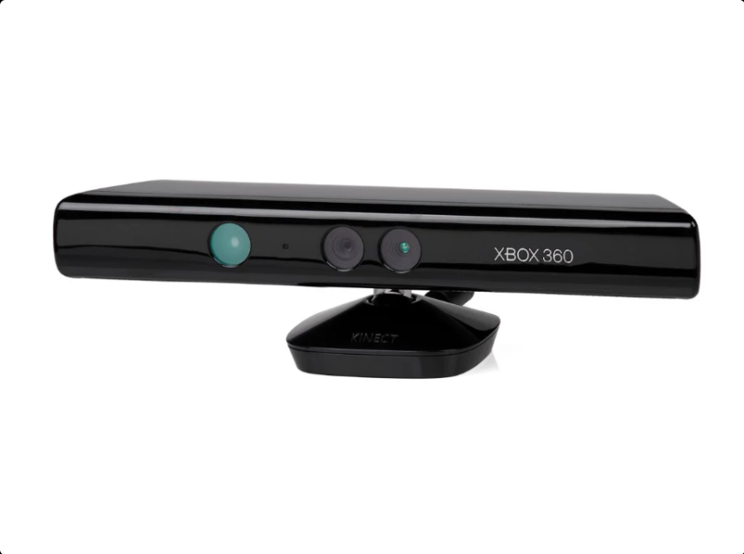
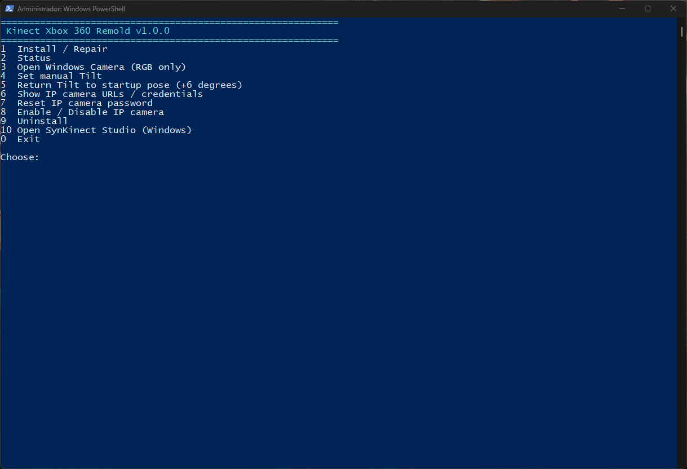

# Kinect Xbox 360 Remold — v1.0.0

Cross-platform runtime and application suite for **Kinect for Xbox 360 / Kinect 1414**, with native Windows and Linux backends and a single Processing application: **SynKinect Studio**.

## Project preview

<p align="center">
  
</p>

## What is included in V1

- one Processing application with five tabs: **3D Scanner**, **Acoustic Scanner**, **Microphones**, **Surveillance** and **Interactivity**;
- one global seven-language UI with **English (`en-US`) as the primary/default language**, followed by `pt-BR`, `es-ES`, `fr-FR`, `de-DE`, `it-IT` and `ja-JP`, with responsive text fitting;
- RGB + metric-Depth 3D interaction with full-body joints, hands, named finger-tip candidates and body-relative desktop gestures;
- a Processing/Linux-compatible `.pde` source with no `static` declarations;
- buffered RGB/depth transport and controlled shutdown/drain behavior for 3D reconstruction;
- compact OBJ/STL/PLY export with indexed geometry, binary formats where appropriate and compressed texture assets;
- Windows native runtime/driver source and build system;
- Linux direct-USB runtime using `libusb-1.0`, ALSA, V4L2, udev and systemd;
- graphical-installable Debian package recipe/output and RPM package recipe;
- cross-platform architecture, build, installation, runtime and release documentation.

## Repository layout

The SynKinect Studio application icon is stored as `applications/processing/SynKinectStudio/data/synkinect-studio-icon.png` and mirrored into the runtime binary folders.


```text
Kinect-Xbox-360-Remold/
├── README.md                       # project overview and visual presentation
├── THIRD-PARTY-NOTICES.md
├── applications/
│   ├── README.md
│   ├── processing/SynKinectStudio/ # editable Processing source and runtime data
│   └── binaries/
│       ├── windows-x64/            # exported Windows application payload
│       └── linux-x64/              # exported Linux application payload
├── drivers/
│   ├── windows/
│   │   ├── source/                 # native Windows source/build/install code
│   │   └── binaries/               # Windows publish/staging target
│   └── linux/
│       ├── source/                 # Linux direct-USB runtime source
│       ├── binaries/x86_64/        # staged Linux runtime
│       └── packages/               # DEB/RPM packaging
├── docs/
│   ├── README.md                   # documentation index
│   ├── images/                     # documentation-only images/screenshots
│   ├── linux/                      # Linux-specific documentation
│   └── windows/                    # Windows-specific documentation
├── licenses/                       # retained third-party license texts
└── scripts/                        # repository-level build/package helpers
```

See [`docs/REPOSITORY-LAYOUT.md`](docs/REPOSITORY-LAYOUT.md)

## SynKinect Studio

The five tools run as tabs inside the same Processing window. Keys `1` through `5` switch tabs. The shell-level **Language** control changes every initialized module together, while modules initialized later inherit the same locale.

SynKinect Studio unifies the five V1 tools in one window. The screenshots below show the current application interface for each tab.

<table>
  <tr>
    <td width="50%"><strong>3D Scanner</strong><br></td>
    <td width="50%"><strong>Acoustic Scanner</strong><br></td>
  </tr>
  <tr>
    <td width="50%"><strong>Microphones</strong><br></td>
    <td width="50%"><strong>Surveillance</strong><br></td>
  </tr>
  <tr>
    <td colspan="2"><strong>Interactivity</strong><br></td>
  </tr>
</table>

| Tab | Purpose |
| --- | --- |
| 3D Scanner | RGB + calibrated metric depth capture, reconstruction, mesh editing and OBJ/STL/PLY export |
| Acoustic Scanner | four-microphone direction/acoustic visualization |
| Microphones | monitoring, recording, playback and diagnostics |
| Surveillance | RGB/IR motion monitoring with compact MP4/H.264 event recording |
| Interactivity | synchronized RGB + metric Depth fusion with full-body XYZ skeleton, hands/fingers and body-relative 3D desktop gestures |

The application deliberately arbitrates camera ownership when switching tabs because Kinect 1414 RGB and raw IR share one physical video engine.


### Global language and responsive UI

SynKinect Studio exposes seven coordinated locales with **English first and selected by default**: English, Portuguese (Brazil), Spanish, French, German, Italian and Japanese. Language state belongs to the Studio shell rather than to individual tabs. Text size follows the live window scale and labels are fitted to their actual button/card bounds before rendering, so long translations do not escape controls after a resize.

### Interactivity

The **3D Scanner and Interactivity tabs share one canonical RGB + metric Depth instance**. A single Kinect transport publishes timestamp-paired `RgbdFramePair` objects using a bounded history, adaptive RGB↔Depth clock-offset estimate and residual-based pairing. Scanner reconstruction consumes the FIFO of those pairs; Interactivity consumes only the newest pair, so neither module can disagree about frame time or stereo calibration. One shared Depth→RGB registration object supplies deprojection/projection and the Scanner’s fine registration offset. Interactivity never subscribes to IR. Depth connected-components select the user and provide metric Z; calibrated RGB luminance edges refine anatomical locations while preserving Depth coordinates. Every skeleton joint carries 2D image coordinates, metric camera-space XYZ, confidence and tracking state. Desktop pointing uses a body-relative 3D interaction volume.

### Surveillance recording

Surveillance event video uses one strict compact recording contract: **MP4/H.264 (`libx264`) through FFmpeg**, with no AVI/MJPEG fallback. The default profile is 512×384 at 10 fps, 384 kbit/s target bitrate, 512 kbit/s maximum bitrate and a long GOP. The nominal video payload at 384 kbit/s is about **2.9 MB/minute** before container overhead; real file size varies with scene complexity. Date/time remains burned into encoded frames. FFmpeg with `libx264` must be available on `PATH`, or `record.ffmpegExecutable` must point to the executable.

`Esc` is consumed by the Studio and never closes the application. The native window close request is also guarded: while Surveillance is armed or recording, the title-bar close button is refused until Surveillance is disarmed.

All UI localization lives in one directory, `applications/processing/SynKinectStudio/data/i18n/`, with one file per supported locale. Keys are namespaced by module. Runtime thresholds for tracking, two-hand gestures and orb-cloud physics live in `data/interaction.properties`.

### 3D capture reliability

The RGBD path performs synchronization once at acquisition. Short per-stream histories are paired into a bounded canonical RGBD queue; Scanner reconstruction consumes FIFO pairs while Interactivity intentionally consumes the newest published pair. Capture, reconstruction, 3D tracking and rendering stay isolated by worker boundaries.

### Compact export

The export workflow uses a true **Save** dialog (`selectOutput()`), suggests the correct extension and runs file generation outside the capture/render thread. Mesh export uses indexed vertices and removes duplicate/degenerate geometry. PLY is binary little-endian; STL is binary; OBJ reuses vertices and limits/compresses external textures.

Configuration is in `applications/processing/SynKinectStudio/data/scanner.properties`.

## Linux runtime

Linux owns the Kinect protocol in user space:

```text
Kinect 1414
  ├─ Camera 045e:02ae -> libusb -> RGB/IR + depth runtime
  ├─ Motor  045e:02b0 -> libusb -> tilt / LED / accelerometer
  └─ Audio  045e:02ad -> firmware bootstrap -> 045e:02bb -> ALSA
```

`libfreenect` is not a build or runtime dependency.

Build:

```bash
./drivers/linux/BUILD.sh
```

For Debian/Ubuntu-family systems, V1 provides a `.deb` under `drivers/linux/packages/output/`. It is intended to be opened with the distribution's graphical software installer, which resolves package dependencies and installs udev/systemd integration without requiring the end user to manually reproduce driver setup commands.

An RPM recipe is available at `drivers/linux/packages/rpm/kinect360-remold.spec` for Fedora/RHEL-family packaging.

Details: `drivers/linux/README.md`, `docs/linux/DRIVER-RUNTIME.md` and `docs/linux/WINDOWS-PARITY.md`.

## Windows runtime

Windows uses Microsoft inbox WinUSB/USB Audio facilities plus Remold user-mode services and Media Foundation components. Native source is under:

### Windows driver/control interface

<p align="center">
  
</p>

Documentation image ownership and naming are described in [`docs/images/README.md`](docs/images/README.md).

```text
drivers/windows/source/
```

Build on Windows 11 x64 with Visual Studio, Windows SDK and WDK:

```text
drivers\windows\BUILD.cmd
```

The final native V1 payload is published into:

```text
drivers\windows\binaries\
```

This GitHub-ready source package intentionally leaves that Windows binary target prepared and documented so a freshly compiled V1 payload can be inserted by the maintainer. See `drivers/windows/binaries/README.md` and `drivers/windows/BINARY-PAYLOAD.md`.

## Build and installation documentation

Start with:

- `docs/QUICKSTART.md`
- `docs/BUILD.md`
- `docs/INSTALLATION.md`
- `docs/ARCHITECTURE.md`
- `docs/PROJECT-STATUS.md`
- `docs/GITHUB-RELEASE.md`

## Hardware validation note

Compilation and software-path validation do not substitute for testing with a physical Kinect. `docs/PROJECT-STATUS.md` explicitly separates implementation/build validation from physical-device validation.

## Third-party work and licensing

See `THIRD-PARTY-NOTICES.md` and `licenses/`. Microsoft Kinect UAC firmware is not redistributed in this repository; the provided tooling obtains the pinned firmware source when required.

No project-wide license grant is inferred from third-party license files. Before publishing this repository for third-party reuse, the maintainer should add the intended top-level project license and update the RPM `License:` field accordingly; see `docs/GITHUB-RELEASE.md`.
