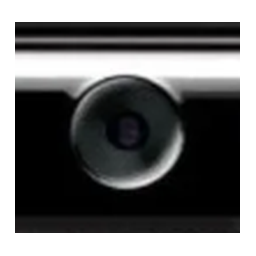
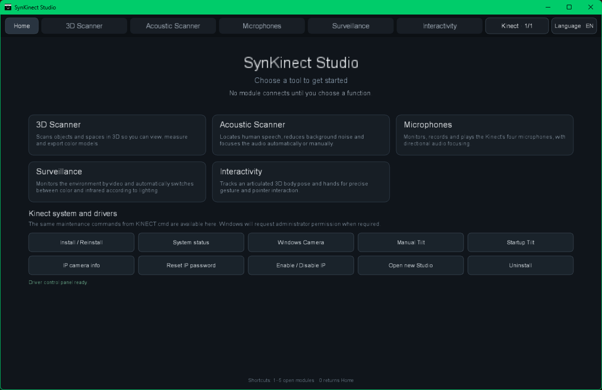
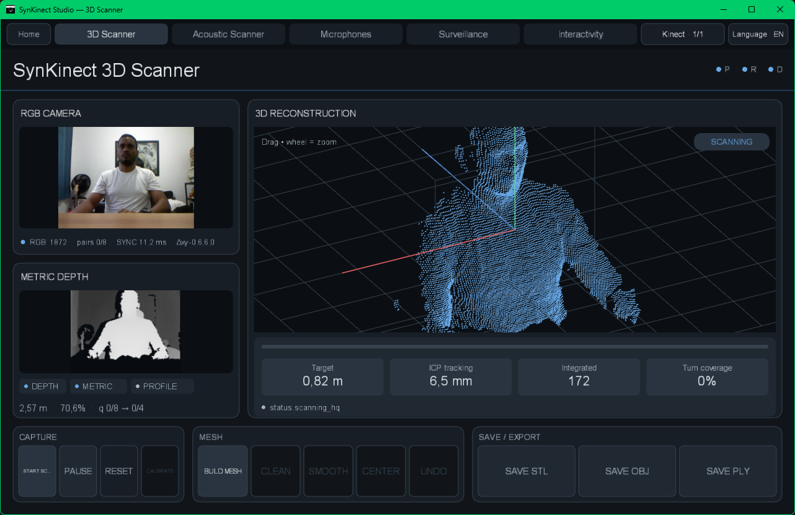
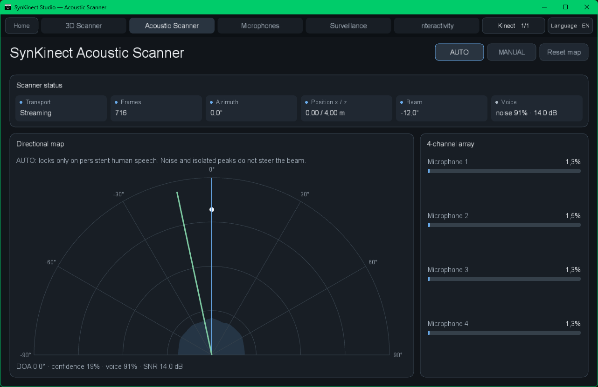
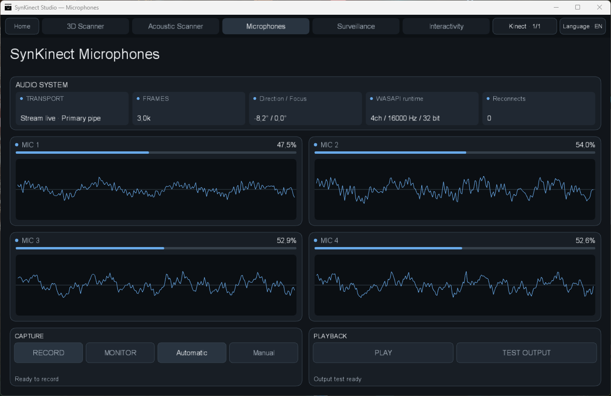
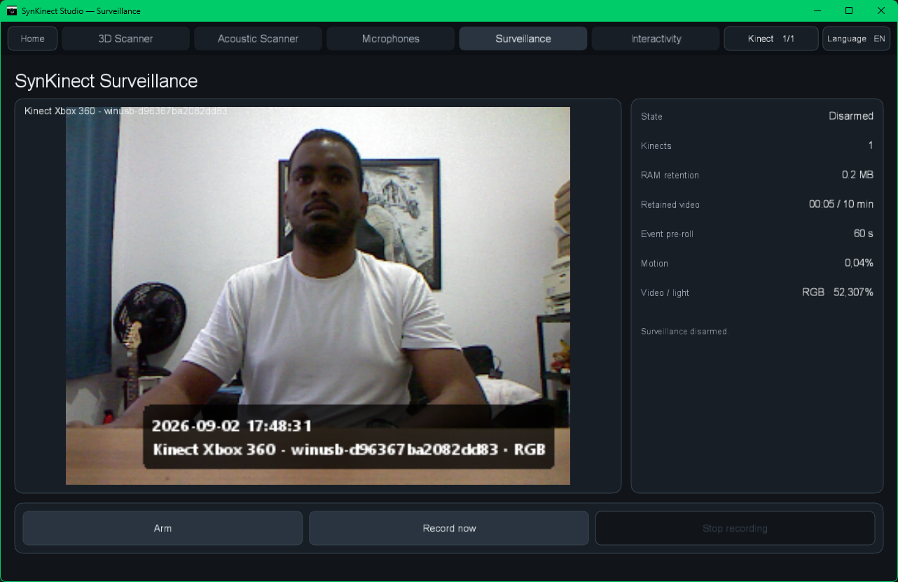
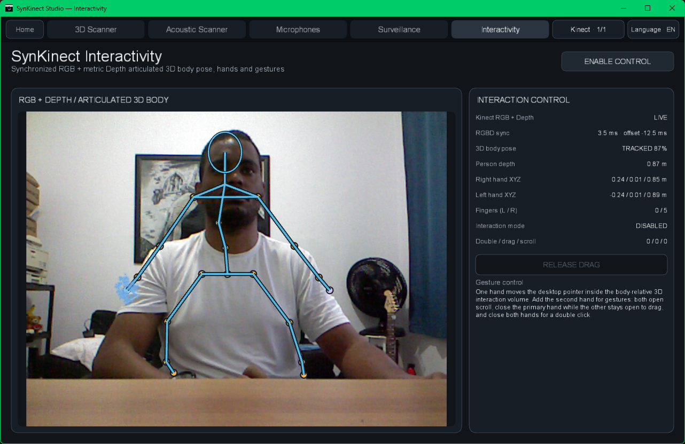

<div align="center">
  

# Kinect Xbox 360 Remold

### A modern runtime and Studio for Kinect for Xbox 360

**Models 1414 + 1473 · RGB · Depth · IR · 4-channel audio · Tilt · LED · Multi-Kinect**


[Quick start](#quick-start) · [Studio](#synkinect-studio) · [Hardware](#hardware-support) · [Architecture](#architecture-at-a-glance) · [Documentation](#documentation)

</div>

<p align="center">
  
</p>

Kinect Xbox 360 Remold gives the original Kinect for Xbox 360 a current, source-driven runtime and a unified desktop application: **SynKinect Studio**. The project targets the two major Xbox 360 sensor revisions, keeps camera/audio/control ownership explicit, and exposes the hardware through practical tools for scanning, acoustics, recording, surveillance and interaction.

> **Clean-source release.** Generated application payloads, native binaries, driver packages, build caches and internal test trees are not stored in this release. `BUILD.cmd` recreates the Windows application/runtime outputs from source and bootstraps pinned dependencies when needed.

## SynKinect Studio

One application, five hardware-focused modules.

<table>
<tr>
<td width="50%">
  <br>
  <b>3D Scanner</b><br>
  RGB + metric Depth reconstruction, calibration, ICP, multi-frame depth fusion, HQ TSDF and OBJ/STL/PLY export.
</td>
<td width="50%">
  <br>
  <b>Acoustic Scanner</b><br>
  Four-microphone GCC-PHAT/TDOA localization, voice gating and AUTO/MANUAL beam steering.
</td>
</tr>
<tr>
<td width="50%">
  <br>
  <b>Microphones</b><br>
  Live synchronized 4-channel capture, diagnostics, recording and beamforming controls.
</td>
<td width="50%">
  <br>
  <b>Surveillance</b><br>
  Multi-Kinect monitoring with RGB/IR day-night switching, motion detection and pre-roll retention.
</td>
</tr>
</table>

<p align="center">
  <br>
  <b>Interactivity</b> — synchronized RGB + metric Depth body pose, hands and gesture-driven interaction.
</p>

### Main capabilities

| Area | V1 capability |
| --- | --- |
| Camera | Raw RGB Bayer, packed IR10 and packed Depth11 transport |
| 3D | Per-device calibration, pose refinement, loop closure, 2× multi-frame depth fusion, HQ TSDF |
| Audio | Synchronized 4-channel microphone array, GCC-PHAT/TDOA, beamforming and recording |
| Control | Tilt, LED and accelerometer through one logical 1414/1473 API |
| Surveillance | RGB/IR lighting adaptation, motion events, in-memory retention and pre-roll |
| Interaction | In-house metric-depth body/silhouette pose and hand interaction |
| Multi-device | Stable physical identity and independent per-Kinect runtime ownership |
| Windows integration | WinUSB camera/control, USB Audio + WASAPI, virtual camera and HTTP/MJPEG IP camera |
| Linux integration | libusb camera/control, ALSA audio and V4L2-oriented runtime adapters |

## Hardware support

| Kinect model | Camera | Motor / control | Audio runtime |
| --- | --- | --- | --- |
| **1414** | `045E:02AE` | dedicated `045E:02B0` | `02AD` boot → Microsoft UAC runtime → 4-channel capture |
| **1473** | `045E:02AE` behind `045E:02C2` hub | `02BB/02C3 & MI_00` after UAC startup | `02AD` boot → `02BB/02C3 & MI_02` → Windows USB Audio / WASAPI |

On Windows, both models use the Microsoft **Kinect Runtime 1.8 UACFirmware 01.02.709.00** path for audio startup. The firmware blob is **not redistributed in this source repository**: the build obtains the pinned Microsoft Runtime package, validates it, extracts the image locally and embeds it into the generated AudioBridge binary.

## Architecture at a glance

```text
                         ┌──────────────────────────┐
                         │     SynKinect Studio     │
                         │ Scanner / Audio / Watch │
                         │     / Interactivity     │
                         └────────────┬─────────────┘
                                      │
                         ScannerPort / named pipes
                                      │
              ┌───────────────────────┼───────────────────────┐
              │                       │                       │
      ┌───────▼────────┐      ┌───────▼────────┐      ┌──────▼───────┐
      │  CameraBridge  │      │  AudioBridge   │      │    Broker    │
      │ RGB / IR / D   │      │ UAC + WASAPI   │      │ Tilt/LED/IMU │
      └───────┬────────┘      └───────┬────────┘      └──────┬───────┘
              │                       │                       │
              └───────────────────────┼───────────────────────┘
                                      │
                              Kinect Xbox 360
                               1414 / 1473
```

The camera boundary remains sensor-native. RGB demosaic, IR unpacking and metric Depth conversion are performed where they are actually consumed rather than being duplicated inside the USB transport layer.

## Quick start

### Windows 11 x64

Requirements: Visual Studio C++ build tools, Windows SDK/WDK, PowerShell 5.1+ and a JDK 17+.

1. Extract or clone the repository into a normal writable folder.
2. Run:

```text
BUILD.cmd
```

3. The build automatically stages the Studio runtime, downloads/verifies pinned Processing/JOGL/GlueGen dependencies, builds the Windows native stack and prepares the generated publication tree.
4. Run:

```text
drivers\windows\binaries\KINECT.cmd
```

5. Choose **Install / Reinstall**, then launch SynKinect Studio from the generated application runtime.

The first Kinect audio build also obtains the pinned Microsoft Kinect Runtime 1.8 package and extracts UACFirmware 01.02.709.00 locally; no Kinect SDK installation is required just to obtain that image.

### Linux x86-64

```bash
./scripts/linux/BUILD-STUDIO.sh
./scripts/linux/BUILD-DRIVER.sh --clean
./drivers/linux/INSTALL.sh
```

The Studio builder also bootstraps and verifies its pinned Processing/JOGL/GlueGen dependencies when the generated runtime tree does not exist yet.

## Source layout

```text
Kinect-Xbox-360-Remold-1.0/
├── BUILD.cmd
├── README.md
├── VERSION
├── applications/
│   ├── processing/SynKinectStudio/     # editable Studio source
│   └── runtime-templates/              # source launchers for generated runtimes
├── drivers/
│   ├── windows/source/                 # Windows camera/audio/control/setup source
│   └── linux/source/                   # Linux native runtime source
├── docs/                               # architecture, setup and protocol documentation
├── scripts/                            # build/package/source-release helpers
└── licenses/                           # third-party license texts
```

Generated trees such as `applications/binaries/`, `drivers/windows/binaries/`, `drivers/linux/dist/`, `.cache/` and package outputs are intentionally ignored.

## Design principles

- **One current V1 architecture** — no compatibility shim for retired ScannerPort formats.
- **Hardware ownership is explicit** — opening or closing a Studio module does not blindly reset healthy physical transports.
- **1414 and 1473 share one logical API** — model-specific USB behavior remains inside the native backend.
- **Raw sensor data stays raw at the transport boundary** — conversion is owned by Studio or an explicit OS/network adapter.
- **Audio timing is preserved** — four microphone channels stay synchronized for TDOA/beamforming instead of being synthesized from a stereo mix.
- **Source builds are reproducible by design** — generated binaries are never repository inputs.

## Documentation

| Document | Purpose |
| --- | --- |
| [Quick start](docs/QUICKSTART.md) | Short build/install/use path |
| [Installation](docs/INSTALLATION.md) | Platform installation details |
| [Architecture](docs/ARCHITECTURE.md) | Cross-platform V1 architecture |
| [Windows architecture](docs/windows/ARCHITECTURE.md) | Windows native stack details |
| [Windows protocol](docs/windows/PROTOCOL.md) | Scanner/control/audio protocol notes |
| [UAC audio runtime](docs/windows/UAC-AUDIO-RUNTIME.md) | 1414/1473 UAC + WASAPI audio path |
| [3D Scanner quality](docs/SCANNER-QUALITY.md) | Reconstruction pipeline and limitations |
| [Native builds](docs/BUILD-DRIVERS.md) | Toolchains, generated outputs and package builds |
| [Project audit](docs/PROJECT-AUDIT.md) | Clean-source repository audit |
| [Contributing](CONTRIBUTING.md) | Source policy and contribution rules |

## Source release validation

Before publishing a source archive:

```bash
./scripts/VERIFY-SOURCE-RELEASE.sh
```

The validator checks that generated output trees and internal tests are absent and that the current camera/audio/control architecture is still present in source.

## Credits and third-party components

The project references or builds against work from Processing, JogAmp/JOGL/GlueGen, OpenKinect and Microsoft components documented in [THIRD-PARTY-NOTICES.md](THIRD-PARTY-NOTICES.md) and the [`licenses/`](licenses/) directory.

---

<div align="center">
  <b>Kinect Xbox 360 Remold V1.0</b><br>
  Reviving Kinect 360 hardware with a current source-driven runtime and Studio.
</div>
